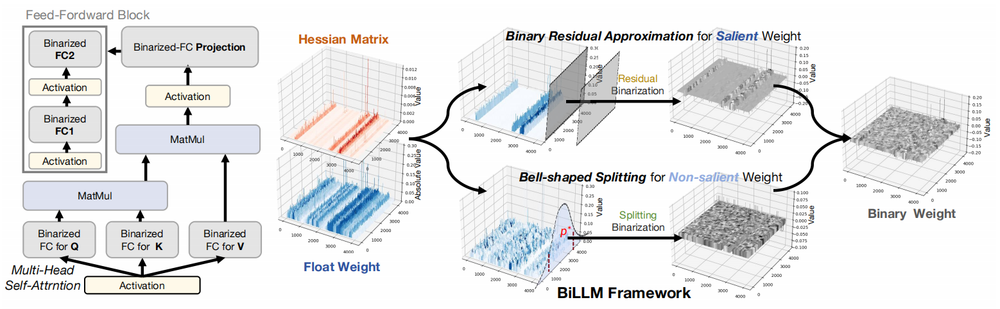
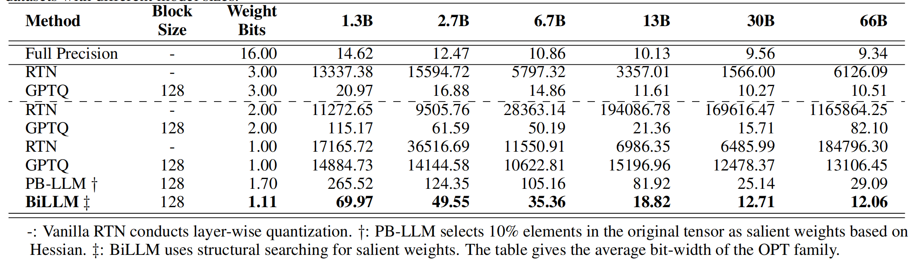
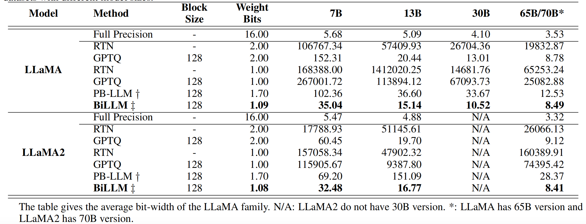
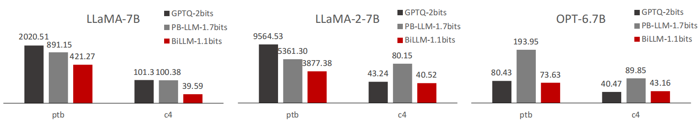
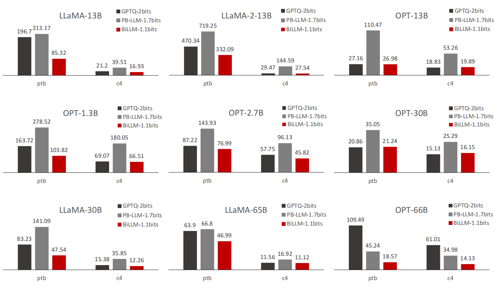
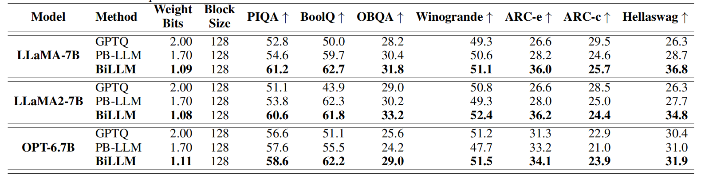
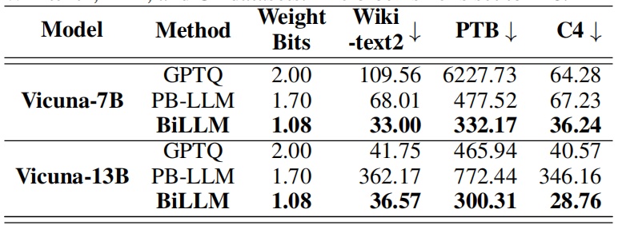

# BiLLM: Pushing the Limit of Post-Training Quantization for LLMs [[PDF]](https://arxiv.org/pdf/2402.04291.pdf)


**<sup>1</sup>The University of Hong Kong <sup>2 </sup>Beihang University <sup> 3</sup>ETH  Zürich**



## Abstract

Pretrained large language models (LLMs) exhibit exceptional general language processing capabilities but come with significant demands on memory and computational resources. As a powerful compression technology, binarization can extremely reduce model weights to a mere 1 bit, lowering the expensive computation and memory requirements. However, existing quantization techniques fall short of maintaining LLM performance under ultra-low bit-widths. In response to this challenge, we present *BiLLM*, a groundbreaking 1-bit post-training quantization scheme tailored for pretrained LLMs. Based on the weight distribution of LLMs, *BiLLM* first identifies and structurally selects salient weights, and minimizes the compression loss through an effective *binary residual approximation* strategy. Moreover, considering the bell-shaped distribution of the non-salient weights, we propose an *optimal splitting search* to group and binarize them accurately. *BiLLM* achieving for the first time high-accuracy inference (e.g. 8.41 perplexity on LLaMA2-70B) with only 1.08-bit weights across various LLMs families and evaluation metrics, outperforms SOTA quantization methods of LLM by significant margins. Moreover, *BiLLM* enables the binarization process of the LLM with 7 billion weights within 0.5 hours on a single GPU, demonstrating satisfactory time efficiency.

## News

- [2024/2] *BiLLM* source code is open now!

## Dependencies

* `torch`: tested on v2.0.1+cu117
* `transformers`: tested on v4.35.0 (the LLaMa integration currently requires a main install from source and `sentencepiece`)
* `datasets`: tested on v2.14.6
* `huggingface-hub`: tested on v0.16.4

All binarization processes and experiments were run on a single 80GB NVIDIA A100. However, all the process can also be conducted on a single 24GB NVIDIA 3090 Ti when the model's parameter is under 70B.

## LLMs Binarization

#### Binarization for OPT families

```
python3 run.py facebook/opt-6.7b c4 braq --blocksize 128 --salient_metric hessian
```


#### Binarization for LLaMA families

```
python3 run.py meta-llama/Llama-2-7b-hf c4 braq --blocksize 128 --salient_metric hessian
```
or
```
python3 run.py huggyllama/llama-7b c4 braq --blocksize 128 --salient_metric hessian
```

#### Binarization for Vicuna families (Instruction Fine-tuning Models)

```
python3 run.py lmsys/vicuna-7b-v1.5 c4 braq --blocksize 128 --salient_metric hessian
```

#### 

## Results

- BiLLM  achieve superior perplexity performance on Wikitext2 datasets  within only an average of **1.11** bit-width weights OPT families.



- BiLLM  achieve superior perplexity performance on Wikitext2 datasets  within only an average of **1.09** bit-width weights LLaMA families and **1.08** bit-width weights LLaMA2 families.



- We also evaluated the performance of *BiLLM* on PTB and C4 datasets. 





- We further evaluated *BiLLM* on 7 zero-shot dataset to give extensive insight on  binarization LLMs

  

- BiLLM  achieve superior perplexity performance on Wikitext2 datasets  within only an average of **1.10** bit-width weights Vicuna families (instruction fine-tune models).



## Related Project
[GPTQ: Accurate Post-training Compression for Generative Pretrained Transformers](https://github.com/IST-DASLab/gptq)

[PB-LLM: Partially Binarized Large Language Models](https://github.com/hahnyuan/PB-LLM)

[AWQ: Activation-aware Weight Quantization for LLM Compression and Acceleration](https://github.com/mit-han-lab/llm-awq)


## Citation

If you find *BiLLM* is useful and helpful to your work, please kindly cite this paper:

```
@article{huang2024billm,
  title={BiLLM: Pushing the Limit of Post-Training Quantization for LLMs},
  author={Huang, Wei and Liu, Yangdong and Qin, Haotong and Li, Ying and Zhang, Shiming and Liu, Xianglong and Magno, Michele and Qi, Xiaojuan},
  journal={arXiv preprint arXiv:2402.04291},
  year={2024}
}
```

